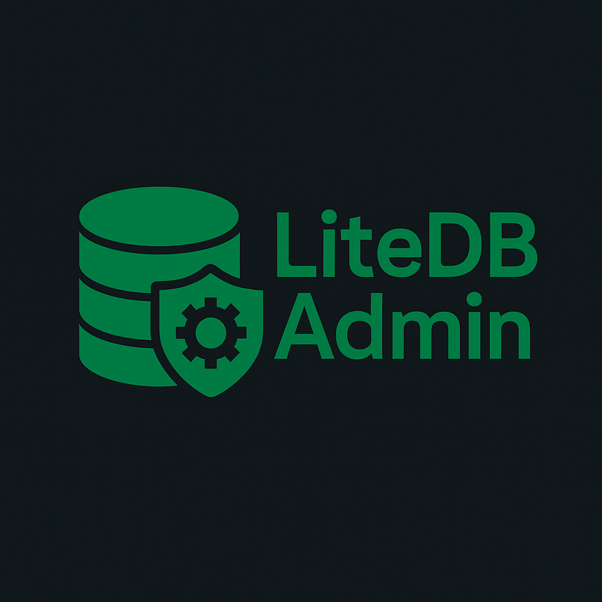

# LiteDBAdmin

<div align="center">




**A lightweight yet powerful SQL administration tool for database management**

</div>

## 📋 Overview

LiteDBAdmin provides a professional interface for database operations with a responsive design that works across all devices. Built for developers who need quick, efficient access to their databases with a clean, modern interface.

<div align="center">

</div>

## ✨ Features

### 🚀 Core Features
- **Professional SQL Editor**: Monaco-based code editor with syntax highlighting and auto-completion
- **Multi-Database Support**: Easily switch between databases with a dropdown selector
- **Table Explorer**: Browse tables and generate SELECT queries with a single click
- **Performance Metrics**: Track query execution time for optimization
- **Responsive Design**: Fully functional on desktops, tablets, and mobile devices

### 🔎 Advanced Query Features
- **Natural Language to SQL**: Convert English descriptions to SQL queries with AI integration
- **Multiple API Providers**: Support for OpenAI, Claude, Gemini, Mistral, DeepSeek, and more
- **Query Suggestions**: Get intelligent SQL keyword and table name suggestions as you type
- **Execution History**: Automatically saves executed queries for quick reference and reuse
- **Saved Queries Library**: Store frequently used queries with descriptions for future use

### 📊 Data Visualization
- **Schema Visualization**: Interactive diagram showing tables and their relationships
- **Automatic Relationship Detection**: Identifies relationships even without foreign key constraints
- **Table Structure Viewer**: Detailed column information including type, constraints, and indexes
- **Export Options**: Export data to SQL or CSV formats with one click

### 🎨 UI/UX Features
- **Dark/Light Mode**: Toggle between themes for reduced eye strain in different environments
- **Quick Insert Forms**: Generate insert forms for any table automatically
- **SQL Formatting**: Beautify your SQL queries with one-click formatting
- **Keyboard Shortcuts**: Execute queries with Ctrl+Enter and other time-saving shortcuts
- **Interactive Cell Editing**: Click on cells to edit values directly in the results table
- **Row Operations**: Edit, duplicate, or delete rows with intuitive single-click operations

### 🔒 Security Features
- **Developer Authentication**: Secure login system with session management
- **Brute Force Protection**: Lockout mechanism after multiple failed login attempts
- **Input Sanitization**: All database operations use proper escaping to prevent SQL injection
- **Error Handling**: Comprehensive error catching without exposing sensitive information

### 🧪 Beta Features

The following features are currently in beta testing and may have limitations:

- **Natural Language to SQL Conversion**: While functional, accuracy varies based on query complexity and database schema
- **DeepSeek Free Integration**: Free AI service may have usage limitations or occasional downtime
- **Schema Relationship Inference**: Automatic relationship detection without explicit foreign keys is experimental
- **Row-Level Operations**: Direct editing, duplication, and deletion of rows in complex tables may require refinement
- **Mobile Interface**: Some advanced features may have limited functionality on smaller screens
- **Data Visualization**: The schema diagram visualization is in beta and may have rendering issues with very complex database structures
- **Interactive Schema Exploration**: Zooming, panning, and interactive elements in the visualization are still being refined

These beta features are actively being improved and we welcome feedback through GitHub issues.

## 🛠️ Installation

1. Clone the repository:
   ```bash
   git clone https://github.com/ayushx309/LiteDBAdmin.git
   ```

2. Configure your database connection:
   - Update `src/LiteDBAdmin/config.php` with your database credentials
   - Or modify the path in `src/LiteDBAdmin/index.php` to point to your existing configuration

3. Configure your web server:
   - Ensure Apache/Nginx is set up to serve the project directory
   - Verify PHP 7.4+ is installed and properly configured

4. Access the application:
   ```
   http://localhost/path-to-LiteDBAdmin/src/
   ```

## ⚙️ Configuration

LiteDBAdmin is highly configurable through the `src/LiteDBAdmin/config.php` file. Here are the key configuration options:

### Database Connection
```php
$host = "localhost";      // Database host
$username = "root";       // Database username
$password = "";           // Database password
$database = "mysql";      // Default database
```

### Security Settings
```php
$dev_password = "@ayushx309@";  // Developer access password - CHANGE THIS!
$max_login_attempts = 5;        // Maximum login attempts before lockout
$lockout_time = 30 * 60;        // Lockout duration in seconds (30 minutes)
```

### Session Configuration
```php
$session_timeout = 3600;        // Session timeout (1 hour)
```

### Performance Settings
```php
$max_execution_time = 30;       // Maximum query execution time (in seconds)
```

### Error Reporting
Error reporting is automatically enabled on development environments (localhost or domains starting with 'dev.') and disabled in production.

## 👩‍💻 Usage Guide

1. **Login**: Enter your developer password in the secure login page
   ```php
   // Current login password is set in src/LiteDBAdmin/config.php
   $dev_password = "@ayushx309@"; // You should change this immediately after installation
   ```

2. **Browse Tables**: 
   - Click any table name in the sidebar to generate a SELECT query
   - View table structure by using the info icon next to table names

3. **Execute Queries**:
   - Write SQL in the editor and click Execute or press Ctrl+Enter
   - View results in the formatted table below
   - Check execution time for performance analysis

4. **Natural Language Queries**:
   - Type a question like "Show me all users who registered in the last month"
   - Select an AI provider and click "Convert to SQL"
   - Review and execute the generated query

5. **Switch Databases**:
   - Select a different database from the dropdown to change context
   - Tables will automatically refresh to show the selected database's structure

6. **Schema Visualization**:
   - View the database schema diagram to understand table relationships
   - Hover over connections to see relationship details

7. **Export Data**:
   - Execute a query and use the export options for the results
   - Export to SQL for database transfers or CSV for spreadsheet analysis

8. **Dark Mode**:
   - Toggle the theme using the Dark Mode button in the sidebar
   - Preference is saved between sessions

## 🔒 Security Recommendations

The current authentication system is basic and designed for development environments. For production use, consider these improvements:

1. **Enhanced Authentication**:
   - Implement a proper user management system with hashed passwords
   - Add user roles and permissions (Admin, Developer, Readonly)
   - Consider OAuth integration for enterprise environments

2. **Additional Security Layers**:
   - IP-based access restrictions
   - Two-factor authentication
   - Audit logging for all database operations
   - SSL/TLS for all connections

3. **Query Restrictions**:
   - Limit which operations can be performed on production databases
   - Add confirmation for potentially destructive operations (DROP, DELETE)
   - Set timeout limits for long-running queries

4. **Configuration Security**:
   - Move `config.php` outside of web-accessible directories
   - Use environment variables for sensitive information instead of hardcoding
   - Implement proper password hashing instead of plaintext passwords

## 🧰 Technical Details

- **Backend**: PHP 7.4+ with MySQL/MariaDB database connectivity
- **Frontend**:
  - Monaco Editor (same as VS Code) for SQL editing
  - Tailwind CSS for responsive design
  - JavaScript for interactive features
  - Cytoscape.js for database schema visualization
- **API Integration**:
  - Multiple AI providers for natural language processing
  - Extensible architecture for adding new AI services

## 📚 Requirements

- PHP 7.4 or higher
- MySQL/MariaDB database
- Modern web browser (Chrome, Firefox, Safari, Edge)
- Internet connection for AI features (optional)

## 🔄 Future Roadmap

- **Enhanced Authentication**: Multi-user support with role-based permissions
- **Database Operations**: Backup and restore functionality
- **Export Formats**: Additional export options (JSON, Excel)
- **Custom Themes**: More visual customization options
- **Query Templates**: Pre-built common query patterns
- **API Access**: RESTful API for programmatic access
- **Mobile App**: Native mobile application
- **Multiple DBMS Support**: Extend beyond MySQL to PostgreSQL, SQLite, etc.

## 🤝 Contributing

Contributions are welcome! LiteDBAdmin is designed to be a community-driven tool that evolves with the needs of developers.

### How to Contribute

1. **Fork the repository**
2. **Create a feature branch**:
   ```
   git checkout -b feature/amazing-feature
   ```
3. **Commit your changes**:
   ```
   git commit -m 'Add some amazing feature'
   ```
4. **Push to the branch**:
   ```
   git push origin feature/amazing-feature
   ```
5. **Open a Pull Request**

### Development Areas

- **Security Enhancements**: Improve authentication and authorization
- **UI/UX Improvements**: Enhance the user interface and experience
- **New Features**: Add functionality that would benefit database administrators
- **Documentation**: Improve or translate documentation
- **Bug Fixes**: Help identify and fix issues

## 📜 License

This project is licensed under the MIT License - see the LICENSE file for details.

## 📬 Contact

Ayush - [@ayushx309](https://github.com/ayushx309)

Project Link: [https://github.com/ayushx309/LiteDBAdmin](https://github.com/ayushx309/LiteDBAdmin)

---

<div align="center">

**Made with ❤️ for database administrators and developers**

[Report Bug](https://github.com/ayushx309/LiteDBAdmin/issues) · [Request Feature](https://github.com/ayushx309/LiteDBAdmin/issues)

</div>
 
